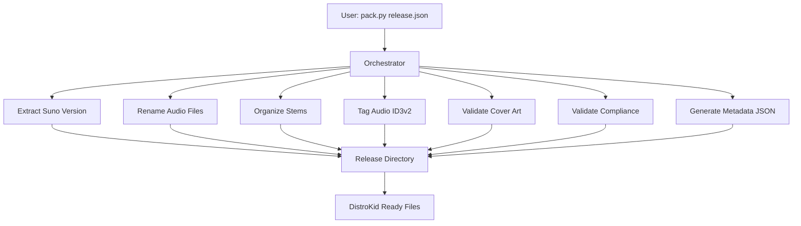

# DistroKid Release Packer

[](https://github.com/elirancv/distrokid-release-packer/actions)
[](https://codecov.io/gh/elirancv/distrokid-release-packer)
[](https://www.python.org/downloads/)
[](https://nodejs.org/)
[](https://opensource.org/licenses/MIT)
[](https://github.com/astral-sh/ruff)

> Command-line automation toolkit for preparing and packaging music tracks generated in Suno for distribution via DistroKid. Automates the complete workflow from audio file export to DistroKid-ready release packages with ID3v2 metadata tagging, compliance validation, and standardized file organization.

---

## Table of Contents

- [Features](#features)
- [Quick Start](#quick-start)
- [Installation](#installation)
- [Usage](#usage)
- [Configuration](#configuration)
- [Architecture](#architecture)
- [Project Structure](#project-structure)
- [Development](#development)
- [Testing](#testing)
- [Technology Stack](#technology-stack)
- [Troubleshooting](#troubleshooting)
- [Roadmap](#roadmap)
- [Contributing](#contributing)
- [License](#license)
- [References](#references)

---

## Features

**Core Capabilities:**
- ✅ **Automated Workflow** - Complete Suno → DistroKid pipeline automation
- ✅ **Rich CLI Interface** - Beautiful, production-ready CLI with Typer and Rich formatting
- ✅ **ID3v2 Tagging** - Full metadata embedding with cover art support
- ✅ **Compliance Validation** - DistroKid requirements checking (dimensions, file size, audio specs)
- ✅ **Batch Processing** - Process multiple releases in a single run with `--batch` flag
- ✅ **Schema Validation** - JSON schema validation with fallback basic validation
- ✅ **Atomic Operations** - Safe file operations with temporary files and atomic renames
- ✅ **Concurrency Safety** - Lock file mechanism prevents concurrent execution conflicts
- ✅ **Structured Logging** - Rotating log files with detailed context (10MB max, 5 backups)
- ✅ **Error Recovery** - Retry mechanisms with exponential backoff for transient failures
- ✅ **Enhanced Error Handling** - Beautiful error messages with actionable solutions and UTF-8 support
- ✅ **Windows Support** - Long path support via pywin32 and reserved filename handling

**Production-Ready:**
- ✅ **Path Safety** - Traversal attack prevention and path validation
- ✅ **Type Safety** - Comprehensive type hints and schema validation
- ✅ **Test Coverage** - 70%+ coverage with unit and integration tests
- ✅ **CI/CD** - Automated testing across multiple OS (Ubuntu, Windows, macOS) and Python versions (3.8-3.11)
- ✅ **Code Quality** - Ruff linting/formatting with pre-commit hooks

---

## Quick Start

**Prerequisites:**
- Python 3.8+
- Node.js 14+ (optional, for JavaScript variant)
- pip and npm

**Install and run:**
```bash
# Install dependencies
make setup

# Initialize project (creates directories and configs)
distrokid init

# Edit configs/release.json with your track details
# Place audio files in runtime/input/ directory

# Run workflow
distrokid pack configs/release.json
# Or use legacy: make run
```

**Expected output:**
```
runtime/output/{TrackName}/
├── Audio/Artist - Title.mp3
├── Stems/ (if enabled)
├── Cover/Artist - Title - Cover.jpg
└── Metadata/Artist - Title - Metadata.json
```

For detailed setup, see [Installation](#installation). For complete workflow documentation, see `docs/QUICK_START.md`.

---

## Installation

### Prerequisites

- Python 3.8+ (required)
- Node.js 14+ (optional, for JavaScript variant)
- pip (Python package manager)
- npm (optional, for JavaScript dependencies)
- Make (optional, for Makefile commands)
- ffmpeg (optional, for audio clipping fix)

### Install

**Option 1: Using Makefile (Recommended)**
```bash
make setup
```

This installs Python dependencies and creates `configs/release.json` from `configs/release.example.json` if missing.

**Option 2: Manual Installation**
```bash
# Install Python dependencies
pip install -r requirements.txt

# Install JavaScript dependencies (optional)
npm install

# Create configuration files
cp configs/release.example.json configs/release.json
cp configs/artist-defaults.example.json configs/artist-defaults.json
```

### Verify Installation

```bash
# Check Python dependencies
make check-python

# Check Node.js dependencies
make check-node

# Or manually
python -c "import mutagen, PIL, librosa; print('Dependencies OK')"
```

### Common Issues

- **ImportError for mutagen/Pillow:** Run `pip install -r requirements.txt`
- **ffmpeg not found:** Install ffmpeg and ensure it's in PATH (only needed for clipping fix)
- **Node.js errors:** Ensure Node.js 14+ is installed (only needed for JavaScript variant)
- **Windows long path errors:** Install `pywin32` for long path support: `pip install pywin32`

### Optional Features

- **Audio clipping detection:** Requires `librosa` (installed via requirements.txt)
- **Audio clipping fix:** Requires `ffmpeg` installed separately
- **JavaScript variant:** Requires Node.js and npm
- **Windows long path support:** Requires `pywin32` (automatically installed on Windows)

---

## Usage

### CLI Commands

**Rich CLI (Recommended) - Beautiful, Production-Ready Interface:**
```bash
# After installation, use the 'distrokid' command
distrokid --help                    # Show help
distrokid --version                 # Show version with beautiful formatting

# Process releases
distrokid pack configs/release.json              # Process single release
distrokid pack configs/release.json --dry-run    # Validate only
distrokid pack configs/release.json --debug       # Enable debug mode
distrokid batch ./releases                       # Process all releases in directory
distrokid batch ./releases --continue-on-error   # Continue on errors

# Configuration management
distrokid config list                            # List all config files
distrokid config show configs/release.json      # View config with Rich JSON formatting
distrokid config create release                  # Create new release config from example
distrokid config create artist-defaults         # Create artist defaults config
distrokid config edit configs/release.json      # Open config in editor

# Validation and checks
distrokid validate configs/release.json          # Validate configuration (with UTF-8 checks)
distrokid validate configs/release.json --no-strict  # Non-strict validation
distrokid check                                  # Check system requirements and dependencies
distrokid status                                 # Show project status and health

# Log management (with test filtering)
distrokid logs list                              # List log files
distrokid logs view                              # View most recent log (filtered)
distrokid logs view release_packer_20251217.log  # View specific log
distrokid logs view --follow                     # Follow log in real-time
distrokid logs tail --lines 50                   # Show last 50 lines
distrokid logs clear --older-than 30            # Clear logs older than 30 days
distrokid logs clear --dry-run                  # Preview what would be deleted

# Project initialization
distrokid init                                   # Initialize project structure
distrokid init --force                           # Overwrite existing files
```

**CLI Features:**
- 🎨 **Beautiful Rich Formatting** - Colorful panels, tables, and syntax highlighting
- ❌ **Enhanced Error Handling** - Clear error messages with actionable solutions
- 🔤 **UTF-8 Support** - Automatic encoding detection and helpful error messages
- 🧹 **Clean Logs** - Automatic filtering of test-related entries
- 📊 **Status Reporting** - Beautiful status panels with success/failure counts
- 🎯 **Production-Ready** - Comprehensive error handling and graceful failures

**Legacy CLI (Still supported):**
```bash
python scripts/pack.py configs/release.json        # Process single release
python scripts/pack.py --batch <directory>          # Process all releases in directory
python scripts/pack.py --batch <dir> --dry-run      # Validate configs only (no processing)
python scripts/pack.py --help                       # Show help
python scripts/pack.py --example                    # Show example config
```

### Programmatic Usage

**Python:**
```python
from scripts.orchestrator import run_release_workflow, load_config
from scripts.batch_processor import process_batch
from pathlib import Path

# Single release
config = load_config("configs/release.json")
success = run_release_workflow(config)

# Batch processing
results = process_batch(
    config_dir=Path("./releases"),
    pattern="release*.json",
    continue_on_error=True,
    dry_run=False
)
```

**JavaScript:**
```javascript
const { runReleaseWorkflow, loadConfig } = require('./scripts/orchestrator');

const config = loadConfig('configs/release.json');
runReleaseWorkflow(config).then(success => {
    console.log('Workflow completed:', success);
});
```

### Makefile Commands

**Setup:**
- `make setup` - Install dependencies and create config
- `make install` - Install Python dependencies
- `make install-js` - Install JavaScript dependencies

**Execution:**
- `make run` - Run the release packer
- `make run-js` - Run using JavaScript orchestrator

**Testing:**
- `make test` - Run all tests
- `make test-cov` - Run tests with coverage report
- `make test-unit` - Run unit tests only
- `make test-integration` - Run integration tests only

**Development:**
- `make lint` - Run linting
- `make format` - Format code
- `make lint-fix` - Auto-fix linting issues

See `make help` for all available commands.

---

## Configuration

### Configuration Files

- `configs/artist-defaults.json` - Default values (artist name, publisher, composer template)
- `configs/release.json` - Release-specific configuration

**Configuration precedence:**
1. `configs/release.json` (release-specific, overrides defaults)
2. `configs/artist-defaults.json` (defaults, used if not in release.json)

### Required Fields

- `title` - Track title
- `source_audio_dir` - Source audio files directory
- `release_dir` - Output directory path

### Optional Fields

- `artist` - Artist name (uses `artist-defaults.json` default if not specified)
- `suno_url` - Suno track URL (for version extraction)
- `source_stems_dir` - Source stems directory
- `genre`, `bpm`, `key`, `explicit`, `language`, `mood`, `target_regions`
- `isrc`, `upc` - Pre-assigned identifiers
- `id3_metadata` - Album, year, track number, composer, publisher, etc.

### Feature Flags

- `rename_audio` - Enable audio file renaming (default: `true`)
- `organize_stems` - Enable stem organization (default: `false`)
- `tag_audio` - Enable ID3v2 tagging (default: `true`)
- `validate_cover` - Enable cover art validation (default: `true`)
- `validate_compliance` - Enable compliance checks (default: `true`)
- `strict_mode` - Fail workflow on any error (default: `false`)
- `strict_schema_validation` - Fail workflow on schema validation errors (default: `true`)
- `overwrite_existing` - Allow overwriting existing files (default: `false`)
- `auto_fix_clipping` - Automatically fix audio clipping (default: `false`)
- `max_retries` - Maximum retry attempts for transient failures (default: `3`)
- `debug` - Enable debug mode with full tracebacks (default: `false`)

See `configs/release.example.json` for a complete example configuration.

---

## Architecture

The project follows a modular script-based architecture where individual workflow steps are implemented as separate scripts, orchestrated by a central coordinator.



**Workflow sequence:**
1. Validate configuration schema and dependencies
2. Initialize structured logging (to `runtime/logs/` directory)
3. Acquire workflow lock (prevent concurrent execution)
4. Check disk space (minimum 500MB)
5. Extract Suno version/build ID (if URL provided)
6. Rename audio files to convention: `Artist - Title.wav/mp3`
7. Organize stems (if enabled) into `Stems/` directory
8. Tag audio files with ID3v2 metadata and embed cover art
9. Validate cover art dimensions (3000×3000) and file size (<5MB)
10. Run full DistroKid compliance checks
11. Generate release metadata JSON file
12. Release workflow lock

**Key Components:**
- **Configuration System:** Two-tier configuration with JSON schema validation
- **Logging:** Structured logging with rotating file handlers (10MB max, 5 backups)
- **Batch Processing:** Process multiple releases with `--batch` flag
- **Error Recovery:** Retry mechanisms with exponential backoff
- **Atomic Operations:** All file operations use temporary files and atomic renames
- **Path Safety:** Traversal prevention and Windows reserved name handling

---

## Project Structure

```
.
├── configs/                   # Configuration files
│   ├── release.example.json   # Release configuration template
│   └── artist-defaults.example.json
├── schemas/                   # JSON schema definitions
│   ├── release_schema.json
│   └── artist_defaults_schema.json
├── scripts/                   # Workflow automation scripts
│   ├── pack.py/js            # CLI entry points
│   ├── orchestrator.py/js     # Main workflow coordinator
│   ├── batch_processor.py     # Batch processing
│   ├── logger_config.py       # Structured logging
│   ├── validate_config.py     # Schema validation
│   ├── retry_utils.py         # Error recovery
│   ├── extract_suno_version.py/js
│   ├── rename_audio_files.py/js
│   ├── organize_stems.py/js
│   ├── tag_audio_id3.py/js
│   ├── validate_cover_art.py
│   ├── validate_compliance.py
│   └── fix_clipping.py
├── tests/                     # Test suite
│   ├── unit/                  # Unit tests
│   │   ├── test_config_validation.py
│   │   ├── test_error_handling.py
│   │   └── test_windows_paths.py
│   ├── integration/           # Integration tests
│   │   ├── test_atomic_operations.py
│   │   ├── test_concurrent_workflows.py
│   │   ├── test_e2e_validation.py
│   │   └── test_full_workflow.py
│   └── fixtures/              # Test data
├── docs/                      # Documentation
│   ├── README.md              # Documentation index
│   ├── QUICK_START.md
│   ├── WORKFLOW.md
│   ├── CONTRIBUTING.md
│   └── CHANGELOG.md
└── runtime/                   # Runtime directories (gitignored)
    ├── input/                  # Source audio files
    ├── output/                 # Generated releases
    └── logs/                   # Log files
```

**Key directories:**
- `scripts/` - Modular workflow scripts and CLI entry points (Python and JavaScript variants)
- `configs/` - Configuration files (example templates and runtime configs)
- `schemas/` - JSON schema definitions for configuration validation
- `docs/` - Comprehensive documentation and guides
- `tests/` - Unit and integration test suite
- `runtime/` - Runtime directories (gitignored)

---

## Development

### Setting Up Development Environment

```bash
# Clone repository
git clone https://github.com/elirancv/distrokid-release-packer.git
cd distrokid-release-packer

# Install development dependencies
make install-all

# Install pre-commit hooks
pip install pre-commit
pre-commit install

# Run tests
make test
```

### Code Style

- **Python:** Use `pathlib.Path` for file operations, `snake_case` for functions
- **JavaScript:** Use `path.join()` for paths, `camelCase` for functions
- **JSON:** Use `snake_case` for keys, ISO 8601 for dates

### Code Quality Tools

- **Linting:** Ruff configured (`ruff.toml`) - fast Python linter
- **Formatting:** Ruff formatter - consistent code style
- **Pre-commit hooks:** Automated checks on git commit
- **Type hints:** Recommended for Python functions

```bash
# Run linting
make lint

# Format code
make format

# Auto-fix linting issues
make lint-fix
```

### PR Workflow

- Branch naming: `feature/description` or `bugfix/description`
- Requires: Tests passing, code follows style guidelines
- See `docs/CONTRIBUTING.md` for detailed guidelines

---

## Testing

**Framework:** pytest

**Coverage:** Minimum 70% threshold enforced via `.coveragerc` and CI

**Test Organization:**
- `tests/unit/` - Unit tests for validation functions and utilities
- `tests/integration/` - Integration tests for full workflow, concurrent execution, atomic operations
- `tests/fixtures/` - Test configuration files and sample data

**CI/CD:** Automated testing on push/PR across multiple OS (Ubuntu, Windows, macOS) and Python versions (3.8, 3.9, 3.10, 3.11)

**Run Tests:**
```bash
make test              # Run all tests
make test-cov          # Run with coverage report
make test-unit         # Run unit tests only
make test-integration  # Run integration tests only
```

---

## Technology Stack

**Runtime & Language:**
- Python 3.8+ (primary implementation)
- Node.js 14+ (alternative implementation)

**Core Dependencies:**
- `mutagen>=1.47.0` - ID3v2 metadata tagging
- `Pillow>=10.0.0` - Image processing
- `librosa>=0.10.0` - Audio analysis (optional)
- `soundfile>=0.12.0` - Audio file I/O
- `rich>=13.0.0` - Terminal output formatting
- `typer>=0.9.0` - CLI framework with Rich integration
- `jsonschema>=4.17.0` - JSON schema validation
- `pywin32>=306` - Windows long path support (Windows only)

**Development Tools:**
- `pytest>=7.0.0` - Testing framework
- `pytest-cov>=4.0.0` - Test coverage reporting
- `ruff>=0.1.0` - Fast Python linter and formatter
- `pre-commit>=3.0.0` - Git hooks framework

**Compatibility:**
- Python: 3.8, 3.9, 3.10, 3.11, 3.12
- Node.js: 14.0+, 16.0+, 18.0+, 20.0+
- OS: Linux, macOS, Windows
- Audio formats: MP3 (tagging), WAV (stems, analysis)

---

## Troubleshooting

**Q: ImportError for mutagen/Pillow**  
A: Install dependencies: `pip install -r requirements.txt`

**Q: Config file not found**  
A: Create from example: `cp configs/release.example.json configs/release.json`

**Q: Audio file not found**  
A: Ensure audio files are in `source_audio_dir` (default: `./runtime/input`)

**Q: Cover art validation fails**  
A: Ensure cover art is 3000×3000 pixels, <5MB, JPG or PNG format

**Q: Workflow lock error**  
A: Another workflow is running or stale lock file exists. Remove `.workflow.lock` if safe.

**Q: Schema validation errors**  
A: Schema validation is strict by default. Check `schemas/release_schema.json` for required fields. Set `strict_schema_validation: false` to allow warnings. Use `distrokid validate configs/release.json` for detailed validation with beautiful formatting.

**Q: UTF-8 encoding errors**  
A: The CLI now provides clear error messages for encoding issues. Open the file in a text editor (VS Code, Notepad++) and save it with UTF-8 encoding. The `validate` command also checks UTF-8 encoding automatically.

**Q: Windows long path errors**  
A: Install `pywin32` for automatic long path support: `pip install pywin32`

**Q: Where are log files?**  
A: Logs are written to `runtime/logs/release_packer_YYYYMMDD.log`. Use `distrokid logs list` to see all logs, or `distrokid logs view` to view the most recent log with automatic test filtering.

**Q: How to process multiple releases?**  
A: Use `distrokid batch ./releases` (recommended) or `python scripts/pack.py --batch <directory>` to process all `release*.json` files.

For more troubleshooting, see `docs/QUICK_START.md` and `docs/WORKFLOW.md`.

---

## Roadmap

**Planned Features:**
- Docker containerization for consistent execution environment
- DistroKid API integration for automated upload after file preparation

**Recent Improvements:**
- ✅ **Rich CLI Interface** - Beautiful Typer-based CLI with Rich formatting, enhanced error handling, and UTF-8 support
- ✅ **Enhanced Error Messages** - All commands now feature beautiful panels with actionable troubleshooting steps
- ✅ **Log Filtering** - Automatic filtering of test-related entries for cleaner log output
- ✅ Structured logging with rotating log files (`runtime/logs/` directory)
- ✅ JSON schema validation for configuration files (`schemas/` directory)
- ✅ Batch processing for multiple releases (`--batch` flag)
- ✅ Automated linting/formatting with Ruff (`ruff.toml` + pre-commit hooks)
- ✅ Coverage enforcement (minimum 70% threshold via `.coveragerc`)
- ✅ Windows-specific testing (`tests/unit/test_windows_paths.py`)
- ✅ Error recovery/retry mechanisms (`scripts/retry_utils.py` with exponential backoff)
- ✅ Strict schema validation mode (`strict_schema_validation` config flag)
- ✅ Atomic file operations (temporary files + atomic renames)
- ✅ Concurrent execution safety (atomic lock file acquisition)
- ✅ Windows long path support (pywin32 integration)

---

## Contributing

We welcome contributions! Please see our [Contributing Guidelines](docs/CONTRIBUTING.md) for details.

**How to contribute:**
1. Fork the repository
2. Create a feature branch (`feature/description`)
3. Make your changes following code style guidelines
4. Add tests for new functionality
5. Run test suite: `make test`
6. Submit a pull request

**Code standards:**
- Follow project coding standards (see `docs/CONTRIBUTING.md`)
- Use structured error handling patterns
- Add tests for validation functions
- Update documentation for new features

**Reporting issues:**
- Use [GitHub Issues](https://github.com/elirancv/distrokid-release-packer/issues)
- Include error messages, config (sanitized), and steps to reproduce

---

## License

**License:** [MIT License](LICENSE)

**Copyright:** Copyright (c) 2025 Eliran Cohen

---

## References

**Documentation:**
- `docs/README.md` - Documentation index
- `docs/QUICK_START.md` - Getting started guide
- `docs/WORKFLOW.md` - Complete workflow checklist
- `docs/HOW_IT_WORKS.md` - Tool architecture explanation
- `docs/USAGE_GUIDE.md` - Detailed usage instructions
- `scripts/README.md` - Scripts documentation

**External Resources:**
- [DistroKid Upload Requirements](https://distrokid.com/help/) - Official DistroKid documentation
- [ID3v2 Specification](https://id3.org/id3v2.3.0) - ID3 tag standard
- [Suno AI](https://suno.ai) - Music generation platform

**Related Projects:**
- `mutagen` - Python ID3v2 library
- `node-id3` - JavaScript ID3v2 library
