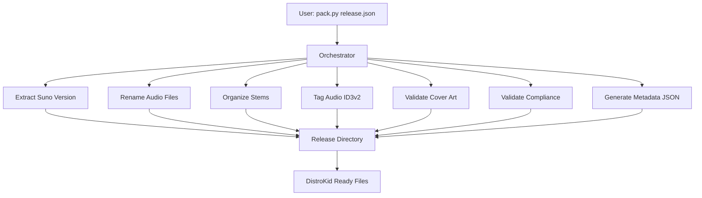

# DistroKid Release Packer

[](https://github.com/elirancv/distrokid-release-packer/actions)
[](https://codecov.io/gh/elirancv/distrokid-release-packer)
[](https://www.python.org/downloads/)
[](https://nodejs.org/)
[](https://opensource.org/licenses/MIT)
[](https://github.com/astral-sh/ruff)

Command-line automation toolkit for preparing and packaging music tracks generated in Suno for distribution via DistroKid. Automates the complete workflow from audio file export to DistroKid-ready release packages with ID3v2 metadata tagging, compliance validation, and standardized file organization.

---

## Quick Start

**Prerequisites:**
- Python 3.8+
- Node.js 14+ (optional, for JavaScript variant)
- pip and npm

**Install and run:**
```bash
# Install dependencies
make setup

# Edit configs/release.json with your track details
# Place audio files in runtime/input/ directory

# Run workflow
make run
```

**Expected output:**
```
runtime/output/{TrackName}/
├── Audio/Artist - Title.mp3
├── Stems/ (if enabled)
├── Cover/Artist - Title - Cover.jpg
└── Metadata/Artist - Title - Metadata.json
```

For detailed setup, see [Installation & Setup](#installation--setup). For complete workflow documentation, see `docs/QUICK_START.md`.

---

## Technology Stack

**Runtime & Language:**
- Python 3.8+ (primary implementation)
- Node.js 14+ (alternative implementation)

**Core Dependencies:**
- `mutagen>=1.47.0` - ID3v2 metadata tagging for MP3 files
- `Pillow>=10.0.0` - Image processing for cover art validation
- `librosa>=0.10.0` - Audio analysis for clipping detection (optional)
- `soundfile>=0.12.0` - Audio file I/O for librosa
- `rich>=13.0.0` - Terminal output formatting and styling
- `jsonschema>=4.17.0` - JSON schema validation for configuration files
- `pywin32>=306` - Windows long path support (Windows only)
- `node-id3@^0.2.1` - ID3v2 tag writing (JavaScript variant)
- `sharp@^0.32.6` - Image processing (JavaScript variant)

**Development Tools:**
- `pytest>=7.0.0` - Testing framework
- `pytest-cov>=4.0.0` - Test coverage reporting
- `ruff>=0.1.0` - Fast Python linter and formatter
- `pre-commit>=3.0.0` - Git hooks framework

**Build & Package:**
- Make (for automation via Makefile)
- pip (Python dependency management)
- npm (JavaScript dependency management)

**External Dependencies:**
- ffmpeg (optional, for audio clipping fix functionality)

---

## Architecture Overview

The project follows a modular script-based architecture where individual workflow steps are implemented as separate scripts, orchestrated by a central coordinator.



**Workflow sequence:**
1. Validate configuration schema and dependencies
2. Initialize structured logging (to `runtime/logs/` directory)
3. Acquire workflow lock (prevent concurrent execution)
4. Check disk space (minimum 500MB)
5. Extract Suno version/build ID (if URL provided)
6. Rename audio files to convention: `Artist - Title.wav/mp3`
7. Organize stems (if enabled) into `Stems/` directory
8. Tag audio files with ID3v2 metadata and embed cover art
9. Validate cover art dimensions (3000×3000) and file size (<5MB)
10. Run full DistroKid compliance checks
11. Generate release metadata JSON file
12. Release workflow lock

**Configuration system:** Two-tier configuration with `artist-defaults.json` (defaults) merged with release-specific `release.json`. Both validated against JSON schemas for type safety and error prevention.

**Logging:** Structured logging to `runtime/logs/release_packer_YYYYMMDD.log` with rotating file handlers (10MB max, 5 backups). Logs include timestamps, function names, line numbers, and full stack traces for debugging.

**Batch processing:** Process multiple releases from a directory with `--batch` flag. Supports dry-run mode for validation-only runs.

---

## Project Structure

```
.
├── .github/                   # GitHub configuration
│   ├── workflows/             # CI/CD pipelines
│   │   └── test.yml
│   ├── ISSUE_TEMPLATE/       # Issue templates
│   │   ├── bug_report.md
│   │   └── feature_request.md
│   └── PULL_REQUEST_TEMPLATE.md
├── .editorconfig             # Editor configuration
├── .gitattributes             # Git attributes (line endings)
├── .pre-commit-config.yaml    # Pre-commit hooks (linting, formatting)
├── ruff.toml                  # Ruff linter/formatter configuration
├── LICENSE                    # MIT License
├── README.md                  # Main project README
├── SECURITY.md                # Security policy
├── CODE_OF_CONDUCT.md         # Code of conduct
├── AUTHORS.md                 # Contributors
├── configs/                   # Configuration files
│   ├── release.example.json   # Release configuration template
│   └── artist-defaults.example.json # Artist default settings template
├── requirements.txt           # Python dependencies
├── package.json               # JavaScript dependencies
├── pyproject.toml             # Python packaging config
├── pytest.ini                 # Test configuration
├── .coveragerc                # Coverage configuration (70% minimum threshold)
├── Makefile                   # Build automation
├── scripts/                   # Workflow automation scripts
│   ├── pack.py/js            # CLI entry points
│   ├── orchestrator.py/js     # Main workflow coordinator
│   ├── batch_processor.py     # Batch processing for multiple releases
│   ├── logger_config.py       # Structured logging configuration
│   ├── validate_config.py     # JSON schema validation
│   ├── retry_utils.py         # Error recovery and retry mechanisms
│   ├── extract_suno_version.py/js
│   ├── rename_audio_files.py/js
│   ├── organize_stems.py/js
│   ├── tag_audio_id3.py/js
│   ├── validate_cover_art.py
│   ├── validate_compliance.py
│   ├── fix_clipping.py
│   └── rich_utils.py          # Terminal output utilities
├── schemas/                   # JSON schema definitions
│   ├── release_schema.json    # release.json validation schema
│   └── artist_defaults_schema.json # artist-defaults.json validation schema
├── docs/                      # Documentation
│   ├── README.md              # Documentation index
│   ├── QUICK_START.md
│   ├── WORKFLOW.md
│   ├── CONTRIBUTING.md        # Contribution guidelines
│   ├── CHANGELOG.md           # Version history
│   └── ...
├── tests/                     # Test suite
│   ├── unit/                  # Unit tests
│   │   ├── test_config_validation.py
│   │   └── test_windows_paths.py # Windows-specific path handling tests
│   ├── integration/          # Integration tests
│   │   ├── test_concurrent_workflows.py
│   │   ├── test_atomic_operations.py
│   │   └── test_e2e_validation.py
│   └── fixtures/              # Test data
└── runtime/                   # Runtime directories (gitignored)
    ├── input/                  # Source audio files
    ├── output/                 # Generated releases
    └── logs/                   # Structured log files (auto-created, rotating)
```

**Key directories:**
- `scripts/` - Modular workflow scripts and CLI entry points (Python and JavaScript variants)
- `configs/` - Configuration files (example templates and runtime configs)
- `schemas/` - JSON schema definitions for configuration validation
- `docs/` - Comprehensive documentation and guides
- `tests/` - Unit and integration test suite
- `runtime/` - Runtime directories (gitignored)
  - `runtime/input/` - Source audio files
  - `runtime/output/` - Generated releases
  - `runtime/logs/` - Structured log files (auto-created, rotating)

---

## Core API & Usage Examples

**Primary entry point:**
```bash
python scripts/pack.py configs/release.json
```

**CLI commands:**
```bash
python scripts/pack.py <configs/release.json>        # Process single release
python scripts/pack.py --batch <directory>            # Process all releases in directory
python scripts/pack.py --batch <dir> --dry-run        # Validate configs only (no processing)
python scripts/pack.py --help                         # Show help
python scripts/pack.py --example                      # Show example config
```

**Programmatic usage (Python):**
```python
from scripts.orchestrator import run_release_workflow, load_config
from scripts.batch_processor import process_batch
from scripts.validate_config import validate_release_config
from pathlib import Path

# Single release
config = load_config("release.json")
success = run_release_workflow(config)

# Batch processing
results = process_batch(
    config_dir=Path("./releases"),
    pattern="release*.json",
    continue_on_error=True,
    dry_run=False
)

# Schema validation
is_valid, errors = validate_release_config(Path("configs/release.json"))
```

**Programmatic usage (JavaScript):**
```javascript
const { runReleaseWorkflow, loadConfig } = require('./scripts/orchestrator');

// Load configuration
const config = loadConfig('release.json');

// Run workflow
runReleaseWorkflow(config).then(success => {
    console.log('Workflow completed:', success);
});
```

**Individual script usage:**
```python
from scripts.tag_audio_id3 import tag_audio_file
from scripts.validate_cover_art import validate_cover_art

# Tag audio file
tag_audio_file("track.mp3", "cover.jpg", {
    "title": "Track Title",
    "artist": "Artist Name",
    "album": "Album Name",
    "year": "2025"
})

# Validate cover art
result = validate_cover_art("cover.jpg")
```

For complete API documentation, see `scripts/README.md`.

---

## Installation & Setup

### Prerequisites

- Python 3.8+ (required)
- Node.js 14+ (optional, for JavaScript variant)
- pip (Python package manager)
- npm (optional, for JavaScript dependencies)
- Make (optional, for Makefile commands)
- ffmpeg (optional, for audio clipping fix)

### Install

**Option 1: Using Makefile (Recommended)**
```bash
make setup
```

This installs Python dependencies and creates `configs/release.json` from `configs/release.example.json` if missing.

**Option 2: Manual Installation**
```bash
# Install Python dependencies
pip install -r requirements.txt

# Install JavaScript dependencies (optional)
npm install

# Create configuration files
cp configs/release.example.json configs/release.json
cp configs/artist-defaults.example.json configs/artist-defaults.json
```

### Verify Installation

```bash
# Check Python dependencies
make check-python

# Check Node.js dependencies
make check-node

# Or manually
python -c "import mutagen, PIL, librosa; print('Dependencies OK')"
```

### Common Issues

- **ImportError for mutagen/Pillow:** Run `pip install -r requirements.txt`
- **ffmpeg not found:** Install ffmpeg and ensure it's in PATH (only needed for clipping fix)
- **Node.js errors:** Ensure Node.js 14+ is installed (only needed for JavaScript variant)
- **Windows long path errors:** Install `pywin32` for long path support: `pip install pywin32`

### Optional Features

- **Audio clipping detection:** Requires `librosa` (installed via requirements.txt)
- **Audio clipping fix:** Requires `ffmpeg` installed separately
- **JavaScript variant:** Requires Node.js and npm
- **Windows long path support:** Requires `pywin32` (automatically installed on Windows)

---

## Environment & Configuration

**Configuration files:**
- `configs/artist-defaults.json` - Default values (artist name, publisher, composer template)
- `configs/release.json` - Release-specific configuration

**Configuration precedence:**
1. `configs/release.json` (release-specific, overrides defaults)
2. `configs/artist-defaults.json` (defaults, used if not in release.json)

**Required fields:**
- `title` - Track title
- `source_audio_dir` - Source audio files directory
- `release_dir` - Output directory path

**Optional fields:**
- `artist` - Artist name (uses `artist-defaults.json` default if not specified)
- `suno_url` - Suno track URL (for version extraction)
- `source_stems_dir` - Source stems directory
- `genre`, `bpm`, `key`, `explicit`, `language`, `mood`, `target_regions`
- `isrc`, `upc` - Pre-assigned identifiers
- `id3_metadata` - Album, year, track number, composer, publisher, etc.

**Feature flags:**
- `rename_audio` - Enable audio file renaming (default: true)
- `organize_stems` - Enable stem organization (default: false)
- `tag_audio` - Enable ID3v2 tagging (default: true)
- `validate_cover` - Enable cover art validation (default: true)
- `validate_compliance` - Enable compliance checks (default: true)
- `strict_mode` - Fail workflow on any error (default: false)
- `strict_schema_validation` - Fail workflow on schema validation errors (default: true, set to false to allow warnings)
- `overwrite_existing` - Allow overwriting existing files (default: false)
- `auto_fix_clipping` - Automatically fix audio clipping (default: false)
- `max_retries` - Maximum retry attempts for transient failures (default: 3)
- `debug` - Enable debug mode with full tracebacks (default: false)

**Environment variables:**
Not detected - No environment variable usage in codebase.

---

## Scripts & Commands

**Makefile commands:**

**Setup:**
- `make setup` - Install dependencies and create release.json
- `make install` - Install Python dependencies
- `make install-js` - Install JavaScript dependencies
- `make install-all` - Install all dependencies

**Execution:**
- `make run` - Run the release packer (requires release.json)
- `make run-js` - Run using JavaScript orchestrator
- `python scripts/pack.py --batch <dir>` - Process multiple releases

**Utilities:**
- `make help` - Show all available commands
- `make example` - Show example configuration
- `make validate` - Validate release.json syntax
- `make check` - Check if dependencies are installed
- `make clean` - Clean temporary files (keeps runtime/output/)
- `make clean-all` - Clean everything including runtime/output/

**Testing:**
- `make test` - Run all tests
- `make test-cov` - Run tests with coverage report
- `make test-unit` - Run unit tests only
- `make test-integration` - Run integration tests only

**Development:**
- `make docs` - Show documentation links
- `make info` - Show project information
- `make version` - Show version info

**npm scripts:**
- `npm run orchestrate` - Run full workflow
- `npm run extract-version` - Extract Suno version
- `npm run rename-audio` - Rename audio files
- `npm run tag-audio` - Tag audio files

---

## Development Workflow

**Setting up development environment:**
```bash
# Clone repository
git clone https://github.com/elirancv/distrokid-release-packer.git
cd distrokid-release-packer

# Install development dependencies
make install-all

# Run tests
make test
```

**Code style:**
- Python: Use `pathlib.Path` for file operations, `snake_case` for functions
- JavaScript: Use `path.join()` for paths, `camelCase` for functions
- JSON: Use `snake_case` for keys, ISO 8601 for dates

**Testing:**
- Framework: pytest
- Run tests: `make test` or `pytest tests/`
- Run with coverage: `make test-cov` or `pytest --cov=scripts tests/`
- Test organization: `tests/unit/` for unit tests, `tests/integration/` for integration tests

**Code quality:**
- **Linting:** Ruff configured (`ruff.toml`) - fast Python linter
- **Formatting:** Ruff formatter - consistent code style
- **Pre-commit hooks:** Automated checks on git commit (see `.pre-commit-config.yaml`)
- Type hints: Recommended for Python functions
- Error handling: Validation functions return structured dicts, operation functions raise exceptions
- File naming: Follow strict conventions (see `.cursor/rules/distrokid.cursorrules`)

**Setup code quality tools:**
```bash
# Install pre-commit hooks
pip install pre-commit
pre-commit install

# Run linting
make lint

# Format code
make format

# Auto-fix linting issues
make lint-fix
```

**PR workflow:**
- Branch naming: `feature/description` or `bugfix/description`
- Requires: Tests passing, code follows style guidelines
- See `docs/CONTRIBUTING.md` for detailed guidelines

---

## Testing & Quality

**Testing:**
- Framework: pytest
- Coverage: Minimum 70% threshold enforced via `.coveragerc` and CI
- Test organization:
  - `tests/unit/` - Unit tests for validation functions and utilities
  - `tests/integration/` - Integration tests for full workflow, concurrent execution, atomic operations
  - `tests/fixtures/` - Test configuration files and sample data
- CI/CD: Automated testing on push/PR across multiple OS (Ubuntu, Windows, macOS) and Python versions (3.8, 3.9, 3.10, 3.11)

**Code quality:**
- Error handling: Structured validation results, exception-based operations
- Type safety: Python type hints recommended and enforced
- File operations: `pathlib.Path` (Python), `path.join()` (JavaScript)
- Atomic operations: File operations use temporary files and atomic renames
- Concurrency safety: Lock file mechanism prevents concurrent workflow execution

**Known gaps & improvements:**

| Gap | Status | Priority | Notes |
|-----|--------|----------|-------|
| Automated linting/formatting | ✅ **Addressed** | - | Ruff configured (`ruff.toml`), pre-commit hooks enabled |
| Coverage percentage tracking | ✅ **Addressed** | - | Minimum 70% threshold enforced via `.coveragerc`, CI fails if below |
| Windows-specific testing | ✅ **Addressed** | - | Windows-specific test suite added (`tests/unit/test_windows_paths.py`) |
| Error recovery/retry mechanisms | ✅ **Addressed** | - | Retry utilities with exponential backoff (`scripts/retry_utils.py`), configurable via `max_retries` |
| Strict schema validation mode | ✅ **Addressed** | - | `strict_schema_validation` flag in config, raises ValueError on schema errors |
| Atomic file operations | ✅ **Addressed** | - | All file operations use temporary files and atomic renames |
| Concurrent execution safety | ✅ **Addressed** | - | Lock file mechanism with atomic acquisition prevents race conditions |
| DistroKid API integration | ❌ Not implemented | Low | Manual upload required after file preparation |
| Docker containerization | ❌ Not implemented | Low | Would provide consistent execution environment |

**Recent additions:**
- ✅ Structured logging with rotating log files (`runtime/logs/` directory)
- ✅ JSON schema validation for configuration files (`schemas/` directory)
- ✅ Batch processing for multiple releases (`--batch` flag)
- ✅ Automated linting/formatting with Ruff (`ruff.toml` + pre-commit hooks)
- ✅ Coverage enforcement (minimum 70% threshold via `.coveragerc`)
- ✅ Windows-specific testing (`tests/unit/test_windows_paths.py`)
- ✅ Error recovery/retry mechanisms (`scripts/retry_utils.py` with exponential backoff)
- ✅ Strict schema validation mode (`strict_schema_validation` config flag)
- ✅ Atomic file operations (temporary files + atomic renames)
- ✅ Concurrent execution safety (atomic lock file acquisition)
- ✅ Windows long path support (pywin32 integration)

---

## Dependencies & Compatibility

**Key dependencies:**
- `mutagen` - ID3v2 metadata tagging; required for audio file tagging
- `Pillow` - Image processing; required for cover art validation
- `librosa` - Audio analysis; optional, for clipping detection
- `rich` - Terminal output; required for formatted CLI output
- `jsonschema` - JSON schema validation; required for config validation
- `pywin32` - Windows long path support; optional but recommended on Windows
- `ruff` - Python linter and formatter; optional but recommended
- `pre-commit` - Git hooks framework; optional but recommended
- `node-id3` - ID3v2 tagging (JavaScript); required for JS variant
- `sharp` - Image processing (JavaScript); required for JS variant

**Compatibility:**
- Python: 3.8, 3.9, 3.10, 3.11, 3.12
- Node.js: 14.0+, 16.0+, 18.0+, 20.0+
- OS: Linux, macOS, Windows (with Windows-specific handling in Makefile and path sanitization)
- Audio formats: MP3 (tagging), WAV (stems, analysis)

**Version constraints:**
- See `requirements.txt` for Python dependencies
- See `package.json` for JavaScript dependencies

---

## Limitations, Assumptions & TODOs

**Known limitations:**
- JavaScript stem tagging uses companion JSON files (WAV ID3 support limitations)
- Node.js disk space check is limited (no built-in API)
- ffmpeg required for clipping fix but not automatically installed
- librosa optional for clipping detection (validation continues if missing)
- No DistroKid API integration (workflow stops at file preparation)
- Schema validation warnings are non-blocking by default (can be made strict via `strict_schema_validation: true`)

**Assumptions:**
- Source audio files exported from Suno and placed in `source_audio_dir` before workflow
- Cover art files follow naming convention in `release_dir/Cover/`
- Python 3.8+ or Node.js 14+ installed and accessible in PATH
- File system permissions allow read/write access
- ffmpeg installed and in PATH if `auto_fix_clipping` enabled
- Windows users have long path support enabled (via pywin32 or registry) for deep directory structures

**TODOs & Improvements:**

| Item | Priority | Details |
|------|----------|---------|
| ✅ Implement structured logging | ~~High~~ | ✅ **Completed** - Logging to `runtime/logs/` directory with rotation |
| ✅ Add JSON schema validation | ~~Medium~~ | ✅ **Completed** - Schemas in `schemas/` directory |
| ✅ Add batch processing | ~~Medium~~ | ✅ **Completed** - `--batch` flag for multiple releases |
| ✅ Add error recovery | ~~Medium~~ | ✅ **Completed** - Retry mechanisms for transient failures |
| ✅ Add strict schema validation mode | ~~Medium~~ | ✅ **Completed** - Fail workflow on schema validation errors |
| ✅ Add atomic file operations | ~~High~~ | ✅ **Completed** - Temporary files and atomic renames |
| ✅ Add concurrent execution safety | ~~High~~ | ✅ **Completed** - Atomic lock file acquisition |
| ✅ Add Windows long path support | ~~Medium~~ | ✅ **Completed** - pywin32 integration |
| Add Docker containerization | Low | Consistent execution environment |
| Add DistroKid API integration | Low | Automated upload after file preparation |

---

## Deployment

**Not applicable:** This is a local development tool intended for use on developer machines, not a deployed service.

**CI/CD:** Automated testing configured via GitHub Actions (`.github/workflows/test.yml`) - runs on push/PR across multiple OS and Python versions. No deployment infrastructure (Docker, containerization) as tool is executed locally via CLI.

---

## Troubleshooting & FAQ

**Q: ImportError for mutagen/Pillow**
A: Install dependencies: `pip install -r requirements.txt`

**Q: Config file not found**
A: Create from example: `cp configs/release.example.json configs/release.json`

**Q: Audio file not found**
A: Ensure audio files are in `source_audio_dir` (default: `./runtime/input`)

**Q: Cover art validation fails**
A: Ensure cover art is 3000×3000 pixels, <5MB, JPG or PNG format

**Q: Workflow lock error**
A: Another workflow is running or stale lock file exists. Remove `.workflow.lock` if safe.

**Q: ffmpeg not found (clipping fix)**
A: Install ffmpeg and ensure it's in PATH, or disable `auto_fix_clipping`

**Q: Tests fail on Windows**
A: Some path handling may differ. Reserved filenames (CON, PRN, etc.) are automatically sanitized. For long paths, install `pywin32` or enable Windows long path support via registry. See "Windows-specific considerations" in Limitations section.

**Q: Schema validation errors**
A: Schema validation is strict by default and will fail the workflow on errors. Check `schemas/release_schema.json` for required fields and types. To allow warnings instead of failing, set `strict_schema_validation: false` in your config.

**Q: Where are log files?**
A: Logs are written to `runtime/logs/release_packer_YYYYMMDD.log`. Check this directory for detailed workflow logs.

**Q: How to process multiple releases?**
A: Use `python scripts/pack.py --batch <directory>` to process all `release*.json` files in a directory. Use `--dry-run` to validate only.

**Q: Windows long path errors**
A: Install `pywin32` for automatic long path support: `pip install pywin32`. Alternatively, enable long path support via Windows registry (see Windows documentation).

---

## Contributing & Community

**How to contribute:**
1. Fork repository
2. Create feature branch (`feature/description`)
3. Make changes following code style guidelines
4. Add tests for new functionality
5. Run test suite: `make test`
6. Submit pull request

**Code standards:**
- Follow `.cursor/rules/distrokid.cursorrules`
- Use structured error handling patterns
- Add tests for validation functions
- Update documentation for new features

**Reporting issues:**
- Use GitHub Issues
- Include error messages, config (sanitized), and steps to reproduce

**Documentation:**
- See `docs/CONTRIBUTING.md` for detailed guidelines
- Update relevant documentation when adding features

---

## License & Attribution

**License:** [MIT License](LICENSE)

**Copyright:** Copyright (c) 2025 Eliran Cohen

---

## References & Further Reading

**Documentation:**
- `docs/README.md` - Documentation index
- `docs/QUICK_START.md` - Getting started guide
- `docs/WORKFLOW.md` - Complete workflow checklist
- `docs/HOW_IT_WORKS.md` - Tool architecture explanation
- `docs/USAGE_GUIDE.md` - Detailed usage instructions
- `docs/FEATURES_IMPLEMENTED.md` - New features documentation (logging, validation, batch processing)
- `docs/CONTRIBUTING.md` - Contribution guidelines
- `docs/CHANGELOG.md` - Version history
- `scripts/README.md` - Scripts documentation

**External resources:**
- [DistroKid Upload Requirements](https://distrokid.com/help/) - Official DistroKid documentation
- [ID3v2 Specification](https://id3.org/id3v2.3.0) - ID3 tag standard
- [Suno AI](https://suno.ai) - Music generation platform

**Related projects:**
- `mutagen` - Python ID3v2 library
- `node-id3` - JavaScript ID3v2 library
