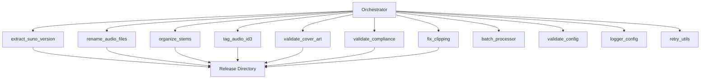

# Scripts Directory

Modular automation scripts for the DistroKid Release Packer workflow. Each script implements a specific workflow step and can be executed independently or orchestrated by the main orchestrator.

---

## Quick Start

**Import and use a script:**
```python
from scripts.tag_audio_id3 import tag_audio_file

tag_audio_file("track.mp3", "cover.jpg", {
    "title": "Track Title",
    "artist": "Artist Name"
})
```

**Run script directly:**
```bash
python scripts/pack.py configs/release.json
```

For complete workflow usage, see the main `README.md`.

---

## Technology Stack

**Python Scripts:**
- Python 3.8+
- `mutagen>=1.47.0` - ID3v2 metadata tagging
- `Pillow>=10.0.0` - Image processing
- `librosa>=0.10.0` - Audio analysis (optional)
- `soundfile>=0.12.0` - Audio file I/O
- `rich>=13.0.0` - Terminal output formatting
- `jsonschema>=4.17.0` - JSON schema validation
- `pywin32>=306` - Windows long path support (Windows only)

**JavaScript Scripts:**
- Node.js 14+
- `node-id3@^0.2.1` - ID3v2 tag writing
- `sharp@^0.32.6` - Image processing

**External Dependencies:**
- ffmpeg (for `fix_clipping.py`)

---

## Architecture Overview

Scripts are organized as independent modules that can be imported and executed by the orchestrator or run standalone.



**Execution model:** Scripts export functions that are called by the orchestrator. Each script performs a single workflow step and can be used independently.

**Key features:**
- **Structured logging** - All scripts use centralized logging via `logger_config.py`
- **Error recovery** - Retry mechanisms via `retry_utils.py` for transient failures
- **Schema validation** - Configuration validation via `validate_config.py` with JSON schemas
- **Batch processing** - Process multiple releases via `batch_processor.py`
- **Atomic operations** - File operations use temporary files and atomic renames
- **Path safety** - Path traversal prevention and Windows reserved name handling

---

## Project Structure

**Core workflow scripts:**
- `pack.py/js` - CLI entry points
- `orchestrator.py/js` - Main workflow coordinator
- `extract_suno_version.py/js` - Extract Suno version from URLs/metadata
- `rename_audio_files.py/js` - Rename audio files to naming convention (with atomic operations)
- `organize_stems.py/js` - Organize stem files with metadata
- `tag_stems.py/js` - Apply ID3v2 tags to stem files
- `tag_audio_id3.py/js` - Apply ID3v2 tags and embed cover art
- `validate_cover_art.py` - Validate cover art compliance
- `validate_compliance.py` - Full DistroKid compliance validator
- `fix_clipping.py` - Fix audio clipping using ffmpeg

**Utility scripts:**
- `batch_processor.py` - Batch processing for multiple releases
- `logger_config.py` - Structured logging configuration with rotating file handlers
- `validate_config.py` - JSON schema validation for configuration files
- `retry_utils.py` - Error recovery and retry mechanisms with exponential backoff
- `rich_utils.py` - Terminal output formatting utilities
- `check_tags.py` - Utility for checking ID3 tags

**Script availability:** All core scripts are implemented in both Python and JavaScript variants.

---

## Core API & Usage Examples

**Extract Suno version:**
```python
from scripts.extract_suno_version import extract_suno_version_from_url

version_info = extract_suno_version_from_url("https://suno.com/song/abc123?v=3.5.2")
# Returns: {"version": "3.5.2", "build_id": "abc123"}
```

**Rename audio files (atomic):**
```python
from scripts.rename_audio_files import rename_audio_files

rename_audio_files(
    artist="Artist Name",
    title="Track Title",
    source_dir="./runtime/input",
    dest_dir="./runtime/output/Track/Audio"
)
# Uses temporary files and atomic renames for safety
```

**Tag audio file:**
```python
from scripts.tag_audio_id3 import tag_audio_file

tag_audio_file(
    audio_path="track.mp3",
    cover_path="cover.jpg",
    metadata={
        "title": "Track Title",
        "artist": "Artist Name",
        "album": "Album Name",
        "year": "2025"
    }
)
```

**Validate cover art:**
```python
from scripts.validate_cover_art import validate_cover_art

result = validate_cover_art("cover.jpg")
# Returns: {"valid": bool, "errors": [], "warnings": []}
```

**Validate compliance:**
```python
from scripts.validate_compliance import full_compliance_check

is_valid = full_compliance_check(
    audio_path="track.mp3",
    cover_path="cover.jpg",
    metadata={"title": "Track", "artist": "Artist"}
)
```

**Fix audio clipping:**
```python
from scripts.fix_clipping import fix_clipping_ffmpeg

fix_clipping_ffmpeg(
    audio_path="track.mp3",
    output_path="track-fixed.mp3",
    target_db=-1.0
)
```

**Batch processing:**
```python
from scripts.batch_processor import process_batch
from pathlib import Path

results = process_batch(
    config_dir=Path("./releases"),
    pattern="release*.json",
    continue_on_error=True,
    dry_run=False
)
```

**Schema validation:**
```python
from scripts.validate_config import validate_release_config

is_valid, errors = validate_release_config("configs/release.json", strict=True)
if not is_valid:
    print("Validation errors:", errors)
```

**Retry mechanisms:**
```python
from scripts.retry_utils import retry, RetryContext, RetryableError

# Decorator-based retry
@retry(max_attempts=3, retryable_exceptions=(IOError, OSError))
def risky_operation():
    # Operation that may fail transiently
    pass

# Context manager-based retry
with RetryContext(max_attempts=3, retryable_exceptions=(IOError,)):
    # Operations with automatic retry
    pass
```

**Structured logging:**
```python
from scripts.logger_config import get_logger

logger = get_logger("my_script")
logger.info("Operation started")
logger.error("Operation failed", exc_info=True)
```

**JavaScript usage:**
```javascript
const { extractSunoVersionFromUrl } = require('./scripts/extract_suno_version');
const { renameAudioFiles } = require('./scripts/rename_audio_files');
const { tagAudioFile } = require('./scripts/tag_audio_id3');

// Similar function calls with camelCase naming
```

---

## Installation & Setup

**Prerequisites:**
- Python 3.8+ (for Python scripts)
- Node.js 14+ (for JavaScript scripts)
- Dependencies installed (see main `README.md`)

**Install dependencies:**
```bash
# Python
pip install -r requirements.txt

# JavaScript
npm install
```

**Verify installation:**
```bash
python -c "from scripts import orchestrator; print('OK')"
node -e "require('./scripts/orchestrator'); console.log('OK')"
```

---

## Environment & Configuration

**Configuration:** Scripts receive configuration through function arguments or from the orchestrator's merged config (`artist-defaults.json` + `release.json`). Configuration is validated against JSON schemas in `schemas/` directory.

**Schema validation:** All configuration files are validated against JSON schemas:
- `schemas/release_schema.json` - Validates `release.json`
- `schemas/artist_defaults_schema.json` - Validates `artist-defaults.json`

**Strict mode:** Schema validation is strict by default. Set `strict_schema_validation: false` in config to allow warnings instead of errors.

---

## Scripts & Commands

**Python script execution:**
```bash
python scripts/pack.py configs/release.json
python scripts/pack.py --batch ./releases
python scripts/pack.py --batch ./releases --dry-run
python scripts/orchestrator.py configs/release.json
```

**JavaScript script execution:**
```bash
node scripts/pack.js configs/release.json
node scripts/orchestrator.js configs/release.json
```

**Programmatic usage:** Import functions and call directly (see Core API section).

---

## Development Workflow

**Code style standards:**

**Python:**
- Use `pathlib.Path` for all file operations
- Function naming: `snake_case` with descriptive verbs
- Always use `json.dump()` with `indent=2`
- Use structured error objects for validation: `{"valid": bool, "errors": [], "warnings": []}`
- Raise exceptions for operation functions (never return None to indicate failure)
- Use type hints for public APIs
- Atomic file operations: Use temporary files and `Path.replace()` for atomic renames

**JavaScript:**
- Use `path.join()` for all path operations
- Function naming: `camelCase` with descriptive verbs
- Always use `JSON.stringify()` with `null, 2` for formatting
- Check file existence before operations
- Validate types before calling `fs.existsSync()` to prevent deprecation warnings

**Error handling patterns:**

**Validation functions:**
```python
def validate_something(input_data):
    """Validate input and return structured result."""
    errors = []
    warnings = []
    
    if not input_data:
        errors.append("Input is required")
    
    return {
        "valid": len(errors) == 0,
        "errors": errors,
        "warnings": warnings
    }
```

**Operation functions:**
```python
def perform_operation(input_data):
    """Perform operation, raise exception on failure."""
    if not input_data:
        raise ValueError("Input is required")
    
    if operation_fails:
        raise RuntimeError("Operation failed: reason")
    
    return result
```

**Exception types:**
- `ValueError` - Invalid input data or configuration
- `FileNotFoundError` - File or directory not found
- `FileExistsError` - File already exists (when overwrite not allowed)
- `ImportError` - Missing required dependency
- `RuntimeError` - Operation failure (with descriptive message)

**File naming conventions:**
- Audio: `Artist - Title.wav` or `Artist - Title.mp3`
- Stems: `Artist - Title - [StemName].wav`
- Cover art: `Artist - Title - Cover.jpg` or `Artist - Title - Cover.png`
- Metadata: `Artist - Title - Metadata.json`
- Stems metadata: `Artist - Title - Stems_Metadata.json`

**Path safety:**
- All paths are validated for traversal attempts (`..`)
- Windows reserved names (CON, PRN, etc.) are automatically sanitized
- Paths are validated against base directories when applicable

---

## Testing & Quality

**Testing:**
- Scripts are tested through unit tests in `../tests/unit/`
- Integration tests in `../tests/integration/` test full workflow, concurrent execution, atomic operations
- Test fixtures in `../tests/fixtures/` provide sample configs
- Windows-specific tests in `../tests/unit/test_windows_paths.py`

**Code quality:**
- Structured error handling (validation vs operation functions)
- Type hints recommended and used for Python functions
- Consistent file naming conventions enforced
- Atomic file operations (temporary files + atomic renames)
- Path safety validation (traversal prevention, reserved name handling)
- Concurrent execution safety (lock file mechanism)

**Code quality tools:**
- **Linting:** Ruff configured (`ruff.toml`) - fast Python linter
- **Formatting:** Ruff formatter - consistent code style
- **Pre-commit hooks:** Automated checks on git commit (see `.pre-commit-config.yaml`)

**Known gaps:**
- Some JavaScript scripts may have limited error context in failure cases
- Windows-specific edge cases may need additional testing

---

## Limitations, Assumptions & TODOs

**Known limitations:**
- JavaScript stem tagging uses companion JSON files (WAV ID3 support limitations)
- Node.js disk space check is limited (no built-in API)
- ffmpeg required for clipping fix but not automatically installed
- librosa optional for clipping detection (validation continues if missing)

**Assumptions:**
- Source files placed in expected directories before script execution
- File system permissions allow read/write access
- Required external tools (ffmpeg) installed and accessible in PATH if needed
- Windows users have long path support enabled (via pywin32 or registry) for deep directory structures

**Completed improvements:**
- ✅ Structured logging implemented (`logger_config.py` with rotating file handlers)
- ✅ Retry mechanisms implemented (`retry_utils.py` with exponential backoff)
- ✅ Schema validation implemented (`validate_config.py` with JSON schemas)
- ✅ Batch processing implemented (`batch_processor.py`)
- ✅ Atomic file operations (temporary files + atomic renames)
- ✅ Path safety validation (traversal prevention, reserved name handling)
- ✅ Concurrent execution safety (atomic lock file acquisition)
- ✅ Windows long path support (pywin32 integration)
- ✅ Enhanced error context (detailed logging with file paths and operation context)

**TODOs:**
- Improve error messages with more context (partially addressed)
- Add progress indicators for long-running operations
- Expand Windows-specific testing coverage

---

## Deployment

**Not applicable:** Scripts are executed locally as part of the CLI tool workflow.

---

## Troubleshooting & FAQ

**Q: ImportError for mutagen/Pillow**
A: Install dependencies: `pip install -r requirements.txt`

**Q: Script fails with FileNotFoundError**
A: Ensure source files exist in expected directories before running

**Q: JavaScript script fails with module not found**
A: Run `npm install` to install JavaScript dependencies

**Q: ffmpeg not found (fix_clipping.py)**
A: Install ffmpeg and ensure it's in PATH, or use alternative method

**Q: Schema validation errors**
A: Check `schemas/release_schema.json` for required fields and types. Set `strict_schema_validation: false` to allow warnings instead of errors.

**Q: Windows long path errors**
A: Install `pywin32` for automatic long path support: `pip install pywin32`. Alternatively, enable long path support via Windows registry.

**Q: Concurrent execution errors**
A: Another workflow is running. Remove `.workflow.lock` if safe (stale lock).

**Q: Where are log files?**
A: Logs are written to `runtime/logs/release_packer_YYYYMMDD.log`. Check this directory for detailed workflow logs.

---

## Contributing & Community

See main `README.md` for contribution guidelines. Scripts must follow the project's code style standards.

---

## License & Attribution

See main `README.md` for license information.

---

## References & Further Reading

- Main `README.md` - Project overview and usage
- `docs/HOW_IT_WORKS.md` - Tool architecture explanation
- `docs/CONTRIBUTING.md` - Code style standards and contribution guidelines
- `docs/FEATURES_IMPLEMENTED.md` - New features documentation
