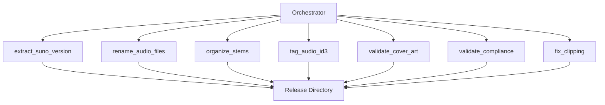

# Scripts Directory

Modular automation scripts for the DistroKid Release Packer workflow. Each script implements a specific workflow step and can be executed independently or orchestrated by the main orchestrator.

---

## Quick Start

**Import and use a script:**
```python
from scripts.tag_audio_id3 import tag_audio_file

tag_audio_file("track.mp3", "cover.jpg", {
    "title": "Track Title",
    "artist": "Artist Name"
})
```

**Run script directly:**
```bash
python scripts/orchestrator.py config.json
```

For complete workflow usage, see the main `README.md`.

---

## Technology Stack

**Python Scripts:**
- Python 3.8+
- `mutagen>=1.47.0` - ID3v2 metadata tagging
- `Pillow>=10.0.0` - Image processing
- `librosa>=0.10.0` - Audio analysis (optional)
- `soundfile>=0.12.0` - Audio file I/O
- `rich>=13.0.0` - Terminal output formatting

**JavaScript Scripts:**
- Node.js 14+
- `node-id3@^0.2.1` - ID3v2 tag writing
- `sharp@^0.32.6` - Image processing

**External Dependencies:**
- ffmpeg (for `fix_clipping.py`)

---

## Architecture Overview

Scripts are organized as independent modules that can be imported and executed by the orchestrator or run standalone.



**Execution model:** Scripts export functions that are called by the orchestrator. Each script performs a single workflow step and can be used independently.

---

## Project Structure

**Core workflow scripts:**
- `orchestrator.py/js` - Main workflow coordinator
- `extract_suno_version.py/js` - Extract Suno version from URLs/metadata
- `rename_audio_files.py/js` - Rename audio files to naming convention
- `organize_stems.py/js` - Organize stem files with metadata
- `tag_stems.py/js` - Apply ID3v2 tags to stem files
- `tag_audio_id3.py/js` - Apply ID3v2 tags and embed cover art
- `validate_cover_art.py` - Validate cover art compliance
- `validate_compliance.py` - Full DistroKid compliance validator
- `fix_clipping.py` - Fix audio clipping using ffmpeg

**Utility scripts:**
- `rich_utils.py` - Terminal output formatting utilities
- `check_tags.py` - Utility for checking ID3 tags

**Script availability:** All core scripts are implemented in both Python and JavaScript variants.

---

## Core API & Usage Examples

**Extract Suno version:**
```python
from scripts.extract_suno_version import extract_suno_version_from_url

version_info = extract_suno_version_from_url("https://suno.com/song/abc123?v=3.5.2")
# Returns: {"version": "3.5.2", "build_id": "abc123"}
```

**Rename audio files:**
```python
from scripts.rename_audio_files import rename_audio_files

rename_audio_files(
    artist="Artist Name",
    title="Track Title",
    source_dir="./exports",
    dest_dir="./Releases/Track/Audio"
)
```

**Tag audio file:**
```python
from scripts.tag_audio_id3 import tag_audio_file

tag_audio_file(
    audio_path="track.mp3",
    cover_path="cover.jpg",
    metadata={
        "title": "Track Title",
        "artist": "Artist Name",
        "album": "Album Name",
        "year": "2025"
    }
)
```

**Validate cover art:**
```python
from scripts.validate_cover_art import validate_cover_art

result = validate_cover_art("cover.jpg")
# Returns: {"valid": bool, "errors": [], "warnings": []}
```

**Validate compliance:**
```python
from scripts.validate_compliance import full_compliance_check

is_valid = full_compliance_check(
    audio_path="track.mp3",
    cover_path="cover.jpg",
    metadata={"title": "Track", "artist": "Artist"}
)
```

**Fix audio clipping:**
```python
from scripts.fix_clipping import fix_clipping_ffmpeg

fix_clipping_ffmpeg(
    audio_path="track.mp3",
    output_path="track-fixed.mp3",
    target_db=-1.0
)
```

**JavaScript usage:**
```javascript
const { extractSunoVersionFromUrl } = require('./scripts/extract_suno_version');
const { renameAudioFiles } = require('./scripts/rename_audio_files');
const { tagAudioFile } = require('./scripts/tag_audio_id3');

// Similar function calls with camelCase naming
```

---

## Installation & Setup

**Prerequisites:**
- Python 3.8+ (for Python scripts)
- Node.js 14+ (for JavaScript scripts)
- Dependencies installed (see main `README.md`)

**Install dependencies:**
```bash
# Python
pip install -r ../requirements.txt

# JavaScript
npm install
```

**Verify installation:**
```bash
python -c "from scripts import orchestrator; print('OK')"
node -e "require('./scripts/orchestrator'); console.log('OK')"
```

---

## Environment & Configuration

**Not detected:** Scripts do not have their own configuration files. They receive configuration through function arguments or from the orchestrator's merged config (`user_settings.json` + `config.json`).

**Inferred:** Scripts read configuration from the orchestrator's merged config when called programmatically.

---

## Scripts & Commands

**Python script execution:**
```bash
python scripts/orchestrator.py config.json
python scripts/extract_suno_version.py
python scripts/rename_audio_files.py
python scripts/tag_audio_id3.py
python scripts/validate_compliance.py
```

**JavaScript script execution:**
```bash
node scripts/orchestrator.js config.json
node scripts/extract_suno_version.js
node scripts/rename_audio_files.js
node scripts/tag_audio_id3.js
```

**Programmatic usage:** Import functions and call directly (see Core API section).

---

## Development Workflow

**Code style standards** (from `.cursor/rules/distrokid.cursorrules`):

**Python:**
- Use `pathlib.Path` for all file operations
- Function naming: `snake_case` with descriptive verbs
- Always use `json.dump()` with `indent=2`
- Use structured error objects for validation: `{"valid": bool, "errors": [], "warnings": []}`
- Raise exceptions for operation functions (never return None to indicate failure)

**JavaScript:**
- Use `path.join()` for all path operations
- Function naming: `camelCase` with descriptive verbs
- Always use `JSON.stringify()` with `null, 2` for formatting
- Check file existence before operations
- Validate types before calling `fs.existsSync()` to prevent deprecation warnings

**Error handling patterns:**

**Validation functions:**
```python
def validate_something(input_data):
    """Validate input and return structured result."""
    errors = []
    warnings = []
    
    if not input_data:
        errors.append("Input is required")
    
    return {
        "valid": len(errors) == 0,
        "errors": errors,
        "warnings": warnings
    }
```

**Operation functions:**
```python
def perform_operation(input_data):
    """Perform operation, raise exception on failure."""
    if not input_data:
        raise ValueError("Input is required")
    
    if operation_fails:
        raise RuntimeError("Operation failed: reason")
    
    return result
```

**Exception types:**
- `ValueError` - Invalid input data or configuration
- `FileNotFoundError` - File or directory not found
- `FileExistsError` - File already exists (when overwrite not allowed)
- `ImportError` - Missing required dependency
- `RuntimeError` - Operation failure (with descriptive message)

**File naming conventions:**
- Audio: `Artist - Title.wav` or `Artist - Title.mp3`
- Stems: `Artist - Title - [StemName].wav`
- Cover art: `Artist - Title - Cover.jpg` or `Artist - Title - Cover.png`
- Metadata: `Artist - Title - Metadata.json`
- Stems metadata: `Artist - Title - Stems_Metadata.json`

---

## Testing & Quality

**Testing:**
- Scripts are tested through unit tests in `../tests/unit/`
- Integration tests in `../tests/integration/` test full workflow
- Test fixtures in `../tests/fixtures/` provide sample configs

**Code quality:**
- Structured error handling (validation vs operation functions)
- Type hints recommended for Python functions
- Consistent file naming conventions enforced

**Known gaps:**
- No automated linting/formatting configuration detected
- Some scripts may have limited error context in failure cases

---

## Limitations, Assumptions & TODOs

**Known limitations:**
- JavaScript stem tagging uses companion JSON files (WAV ID3 support limitations)
- Node.js disk space check is limited (no built-in API)
- ffmpeg required for clipping fix but not automatically installed
- librosa optional for clipping detection (validation continues if missing)
- No error recovery or retry mechanisms
- No structured logging (uses Rich for output formatting)

**Assumptions:**
- Source files placed in expected directories before script execution
- File system permissions allow read/write access
- Required external tools (ffmpeg) installed and accessible in PATH if needed

**TODOs:**
- Implement structured logging instead of print statements
- Add retry mechanisms for transient failures
- Improve error messages with more context
- Add progress indicators for long-running operations

---

## Deployment

**Not applicable:** Scripts are executed locally as part of the CLI tool workflow.

---

## Troubleshooting & FAQ

**Q: ImportError for mutagen/Pillow**
A: Install dependencies: `pip install -r ../requirements.txt`

**Q: Script fails with FileNotFoundError**
A: Ensure source files exist in expected directories before running

**Q: JavaScript script fails with module not found**
A: Run `npm install` to install JavaScript dependencies

**Q: ffmpeg not found (fix_clipping.py)**
A: Install ffmpeg and ensure it's in PATH, or use alternative method

---

## Contributing & Community

See main `README.md` for contribution guidelines. Scripts must follow code style standards in `.cursor/rules/distrokid.cursorrules`.

---

## License & Attribution

See main `README.md` for license information.

---

## References & Further Reading

- Main `README.md` - Project overview and usage
- `docs/HOW_IT_WORKS.md` - Tool architecture explanation
- `.cursor/rules/distrokid.cursorrules` - Code style standards
